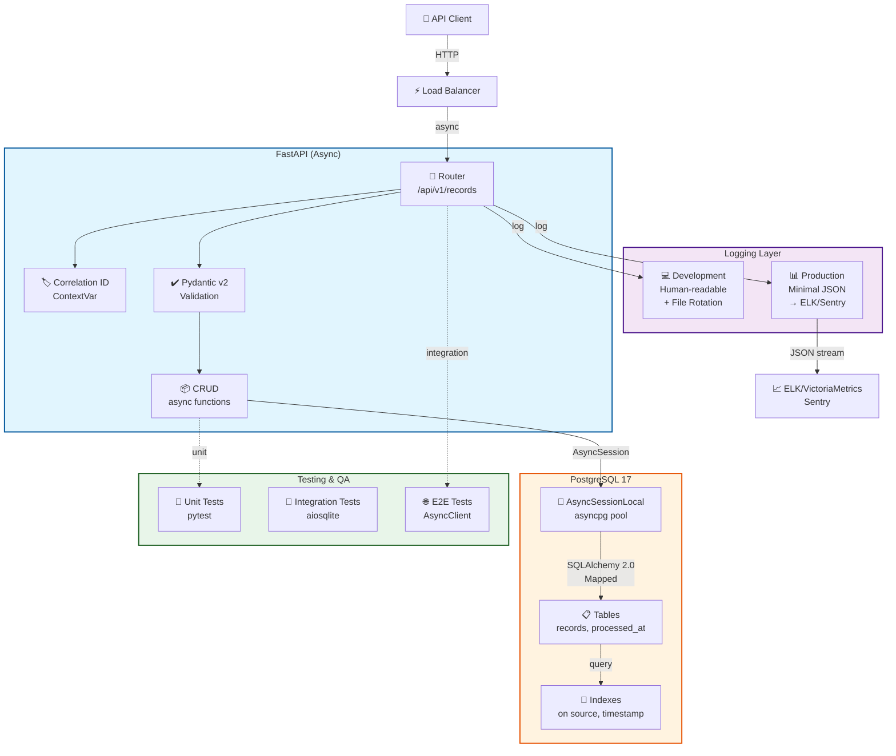

# System Architecture — Data Zoo Platform

**Last Updated**: April 18, 2026
**Scope**: Phase 0 (Foundation) → Phase 8 (Production)
**Status**: In Design (Phase 1+ implementation pending)

---

## Monorepo Target Structure (Phases 0–8)

```
data-pipeline-async/
├── app/                          (Phase 1+: Ingestor service)
│   ├── main.py
│   ├── crud.py
│   ├── models.py
│   ├── schemas.py
│   ├── events.py                 (← Phase 1: Kafka producer)
│   ├── routers/
│   ├── scrapers/                 (← Phase 2: Scraper implementations)
│   ├── storage/mongo.py           (← Phase 2: MongoDB client)
│   └── core/circuit_breaker.py    (← Phase 4: Resilience patterns)
│
├── services/                      (← Phase 1+: New microservices)
│   ├── processor/                 (Phase 1: Kafka consumer)
│   ├── ai-gateway/               (Phase 3: Embeddings + Qdrant)
│   ├── query-api/                (Phase 5: Analytics + CQRS)
│   └── dashboard/                (Phase 6: HTMX + SSE frontend)
│
├── infra/
│   ├── terraform/                (← Phase 7: IaC for AWS)
│   ├── monitoring/               (← Phase 8: Prometheus + Grafana)
│   ├── scripts/
│   │   ├── backup.sh             (← Phase 8)
│   │   └── chaos.sh              (← Phase 8)
│   └── database/
│
├── docs/
│   ├── adr/                       (← Phase 0: ADR stubs)
│   │   ├── 001-kafka-vs-rabbitmq.md
│   │   ├── 002-qdrant-vs-pgvector.md
│   │   └── 003-htmx-vs-react.md
│   ├── architecture.md            (← This file, monorepo target structure)
│   ├── pillar-*.md               (Consolidated domain knowledge)
│   └── decisions.md              (Tech choice trade-off reasons)
│
├── learning_docs/
│   └── ACTION_PLAN.md            (← Phase 0: 8-week execution roadmap)
│
├── .github/
│   ├── instructions/             (8 phase guides + templates)
│   ├── prompts/
│   │   ├── plan-dataZooScaffolding.prompt.md
│   │   └── plan-dataZooPlatform.prompt.md
│   └── workflows/
│
├── docker-compose.yml            (← Evolves per phase)
├── pyproject.toml                (← Evolves per phase)
└── README.md
```

---

## Phase Progression

| Phase | Focus | Services | Components Added |
|-------|-------|----------|------------------|
| **0** | Docs & Planning | — | ADRs, architecture, ACTION_PLAN |
| **1** | Event Streaming | ingestor, processor | Redpanda, Kafka producer/consumer |
| **2** | Data Scraping | scrapers, MongoDB | HTTP/HTML/browser scrapers |
| **3** | Docker + CI/CD | + build pipeline | Multi-stage Docker, GitHub Actions |
| **4** | AI + Vector DB | ai-gateway | Qdrant, embeddings, semantic search |
| **5** | Testing | + chaos tests | pytest fixtures, async mocking |
| **6** | Database | query-api | 40 SQL patterns, materialized views |
| **7** | Security | auth layer | JWT, rate limiting, secrets |
| **8** | Infrastructure | + Terraform | AWS deployment (RDS, ECS, Fargate) |

---

## High-Level Data Flow (Phase 8 complete)

```mermaid
graph TB
    Client["👤 API Client (HTTPS)"]
    ALB["⚡ AWS Application\nLoad Balancer"]

    subgraph Compute["AWS ECS Fargate"]
        Ingestor["📝 Ingestor<br/>(app/)"]
        Processor["⚙️ Processor<br/>(services/)"]
        AIGateway["🤖 AI Gateway<br/>(embeddings)"]
        QueryAPI["📊 Query API<br/>(analytics)"]
        Dashboard["🎨 Dashboard<br/>(HTMX)"]
    end

    subgraph Data["AWS Data Layer"]
        RDS["🗄️ PostgreSQL 17<br/>(RDS)"]
        Qdrant["🔍 Qdrant<br/>(vector DB)"]
        Redis["⚡ Redis<br/>(ElastiCache)"]
    end

    subgraph Messaging["AWS MSK<br/>(Kafka)"]
        Topics["📬 Topics<br/>records.events<br/>records.events.dlq"]
    end

    subgraph Observability["Observability"]
        Prometheus["📈 Prometheus"]
        Grafana["📊 Grafana"]
        Jaeger["🔍 Jaeger"]
    end

    Client -->|HTTPS| ALB
    ALB --> Ingestor
    ALB --> Dashboard

    Ingestor -->|publish| Topics\n    Ingestor -->|write| RDS\n    Ingestor -->|cache| Redis\n    \n    Topics -->|consume| Processor\n    Processor -->|embed| AIGateway\n    Processor -->|store| Qdrant\n    Processor -->|log errors| Topics\n    \n    AIGateway -->|store| Qdrant\n    QueryAPI -->|read analytics| RDS\n    QueryAPI -->|listen| Topics\n    \n    Dashboard -->|query| QueryAPI\n    Dashboard -->|search| AIGateway\n    \n    Ingestor -->|metrics| Prometheus\n    Processor -->|metrics| Prometheus\n    QueryAPI -->|metrics| Prometheus\n    Prometheus -->|visualize| Grafana\n    \n    Ingestor -->|trace| Jaeger\n    Processor -->|trace| Jaeger
    \n    style Compute fill:#e3f2fd,stroke:#1976d2\n    style Data fill:#fff3e0,stroke:#e65100\n    style Messaging fill:#f3e5f5,stroke:#6a1b9a\n    style Observability fill:#e8f5e9,stroke:#2e7d32
```

---

## Phase 0: Docs Consolidation (Foundation)

**Goal**: Establish single source of truth before any Phase 1 code.

### Architecture Goals

1. **Monorepo structure** — clearly separates services and shared code
2. **ADR-driven decisions** — all major choices documented with trade-offs
3. **Consolidated docs** — `docs/pillar-*.md` own one domain each; no duplication
4. **Execution roadmap** — `learning_docs/ACTION_PLAN.md` maps 8 phases to 16 weeks

### Key Files Created

- [ADR 001: Kafka vs RabbitMQ](adr/001-kafka-vs-rabbitmq.md) — Why Redpanda + Kafka API
- [ADR 002: Qdrant vs pgvector](adr/002-qdrant-vs-pgvector.md) — Why Qdrant primary, pgvector secondary
- [ADR 003: HTMX vs React](adr/003-htmx-vs-react.md) — Why HTMX + backend templates (Phase 6)
- This file: `docs/architecture.md` — Monorepo target + data flow diagrams

---

## High-Level View (Phase 1 — Current State)



## Components

### 🔀 FastAPI Application Layer

**Location**: \`app/main.py\`, \`app/routers/\`

**Responsibilities:**

- HTTP endpoint routing (\`/api/v1/records/*\`)
- Request validation via Pydantic v2
- Dependency injection (database sessions, logging)
- Error handling & HTTP exceptions
- Correlation ID propagation

### 📦 CRUD Layer

**Location**: \`app/crud.py\`

**Responsibilities:**

- Pure async database operations
- SQLAlchemy 2.0 ORM queries (\`select()\`, \`insert()\`, \`update()\`)
- Session lifecycle management
- Transaction handling (\`commit/rollback\`)

**Key Pattern:**
\`\`\`python
async def get_record(db: AsyncSession, record_id: int) -> Record | None:
    result = await db.execute(select(Record).where(Record.id == record_id))
    return result.scalar_one_or_none()
\`\`\`

### 🗄️ PostgreSQL + asyncpg

**Location**: \`app/database.py\`

**Configuration:**

- \`pool_size=5\`: Connections in pool
- \`max_overflow=10\`: Extra connections under load
- \`expire_on_commit=False\`: Keep ORM objects after commit (CRITICAL!)

### 🏷️ Correlation ID Tracing

**Location**: \`app/core/logging.py\`

Tracks requests end-to-end via ContextVar, injected into every log.

### 📊 Environment-Aware Logging

**Development:**
\`\`\`
2026-04-16 11:18:05 | INFO | app/routers/records.py:45:create_record | [cid-123] record created
\`\`\`

**Production:**
\`\`\`json
{"message": "record_created", "user_id": 42, "cid": "cid-123"}
\`\`\`

### 🧪 Testing Pyramid

- **Unit**: Isolated functions (5+ tests)
- **Integration**: Components together with aiosqlite (20 tests)
- **E2E**: Full HTTP roundtrip with AsyncClient (20 tests)

## How to Update This Diagram

1. Edit this file (\`docs/architecture.md\`)
2. Modify Mermaid syntax
3. Commit & push:
   \`\`\`bash
   git add docs/architecture.md
   git commit -m "docs: update architecture"
   git push origin main
   \`\`\`
4. GitHub auto-renders the diagram
5. Team reviews in PR before merging

## Key Design Decisions

| Decision | Rationale |
| ---------- | ----------- |
| Async/Await | Non-blocking I/O → handle 100s concurrent requests |
| SQLAlchemy 2.0 | Type-safe ORM with modern Python syntax |
| Pydantic v2 | Validation + serialization in one place |
| Environment-aware logging | Dev: readable; Prod: structured JSON |
| In-memory aiosqlite tests | Fast, no infrastructure needed |

## Related Documents

- [API Routes](../app/routers/records.py)
- [Database Models](../app/models.py)
- [Performance Benchmarks](../tests/integration/records/test_performance.py)
- [6-Week Action Plan](../learning_docs/ACTION_PLAN.md)

**Questions?** Open a GitHub issue or PR against this document.
