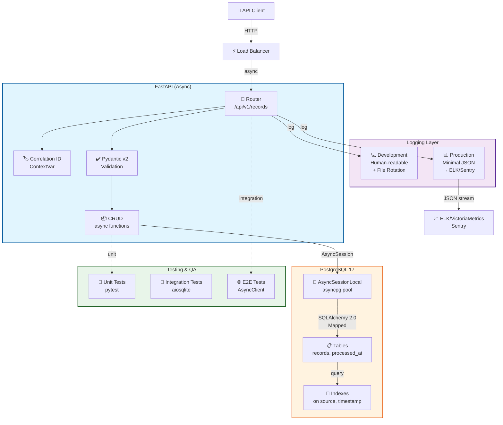

# System Architecture — Data Pipeline Async

**Last Updated**: April 16, 2026  
**Status**: Production-Ready  
**Diagram Format**: Mermaid (git-shareable, collaboratable)

## High-Level View

## Components

### 🔀 FastAPI Application Layer

**Location**: \`app/main.py\`, \`app/routers/\`

**Responsibilities:**
- HTTP endpoint routing (\`/api/v1/records/*\`)
- Request validation via Pydantic v2
- Dependency injection (database sessions, logging)
- Error handling & HTTP exceptions
- Correlation ID propagation

### 📦 CRUD Layer

**Location**: \`app/crud.py\`

**Responsibilities:**
- Pure async database operations
- SQLAlchemy 2.0 ORM queries (\`select()\`, \`insert()\`, \`update()\`)
- Session lifecycle management
- Transaction handling (\`commit/rollback\`)

**Key Pattern:**
\`\`\`python
async def get_record(db: AsyncSession, record_id: int) -> Record | None:
    result = await db.execute(select(Record).where(Record.id == record_id))
    return result.scalar_one_or_none()
\`\`\`

### 🗄️ PostgreSQL + asyncpg

**Location**: \`app/database.py\`

**Configuration:**
- \`pool_size=5\`: Connections in pool
- \`max_overflow=10\`: Extra connections under load
- \`expire_on_commit=False\`: Keep ORM objects after commit (CRITICAL!)

### 🏷️ Correlation ID Tracing

**Location**: \`app/core/logging.py\`

Tracks requests end-to-end via ContextVar, injected into every log.

### 📊 Environment-Aware Logging

**Development:**
\`\`\`
2026-04-16 11:18:05 | INFO | app/routers/records.py:45:create_record | [cid-123] record created
\`\`\`

**Production:**
\`\`\`json
{"message": "record_created", "user_id": 42, "cid": "cid-123"}
\`\`\`

### 🧪 Testing Pyramid

- **Unit**: Isolated functions (5+ tests)
- **Integration**: Components together with aiosqlite (20 tests)
- **E2E**: Full HTTP roundtrip with AsyncClient (20 tests)

## How to Update This Diagram

1. Edit this file (\`docs/architecture.md\`)
2. Modify Mermaid syntax
3. Commit & push:
   \`\`\`bash
   git add docs/architecture.md
   git commit -m "docs: update architecture"
   git push origin main
   \`\`\`
4. GitHub auto-renders the diagram
5. Team reviews in PR before merging

## Key Design Decisions

| Decision | Rationale |
|----------|-----------|
| Async/Await | Non-blocking I/O → handle 100s concurrent requests |
| SQLAlchemy 2.0 | Type-safe ORM with modern Python syntax |
| Pydantic v2 | Validation + serialization in one place |
| Environment-aware logging | Dev: readable; Prod: structured JSON |
| In-memory aiosqlite tests | Fast, no infrastructure needed |

## Related Documents

- [API Routes](../app/routers/records.py)
- [Database Models](../app/models.py)
- [Performance Benchmarks](../tests/integration/records/test_performance.py)
- [6-Week Action Plan](../learning_docs/ACTION_PLAN.md)

**Questions?** Open a GitHub issue or PR against this document.
